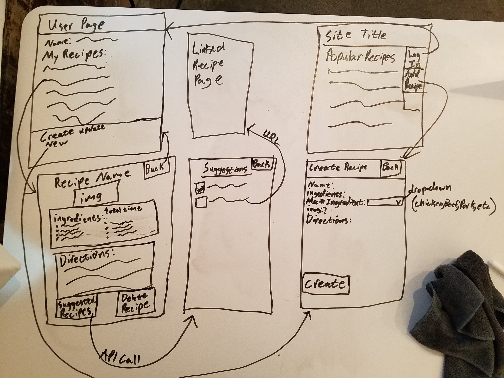
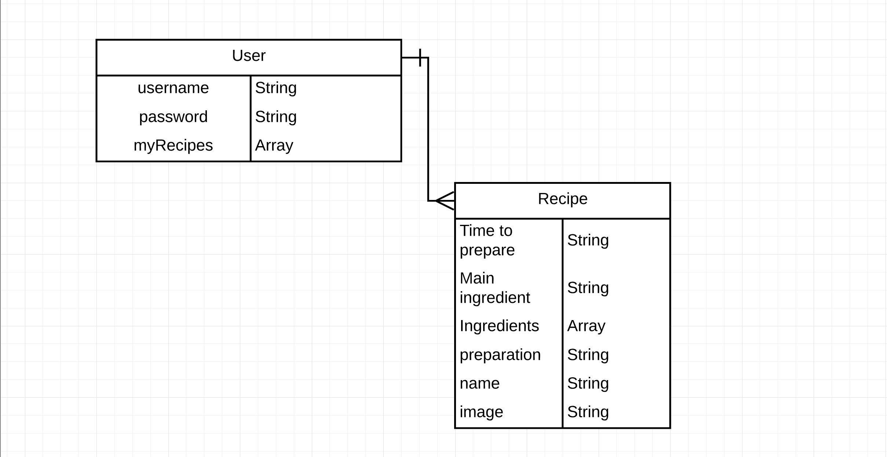

# Project 3: Recipe Box

---

## Overview

For Project 3 I created an app that allows the user to create, update, and delete recipes. When users reach the site they will see a list of recipes from the site and a navigation bar with a link to log in.  They will be able to access their recipes and modify them. 

# [Link to App](https://project3-recipes.herokuapp.com/)

## [Link to Trello](https://trello.com/b/QWkyQ1YG/project-3-wdi18)

---

## Technologies Used

- Node.js
- Express
- MongoDB
- Mongoose
- MongoDB Compass
- Postman
- VisualStudio Code
- ReactJs
- Styled Components

---

## Wireframe

---

## ERD

## Future Development

- API call to retreive and display recipes

- Link API to use main ingredient of existing recipes to suggest other recipes

- Homepage will show recipes from API

- User will be able to select a main ingredient and have a random recipe from the database display based on that ingredient